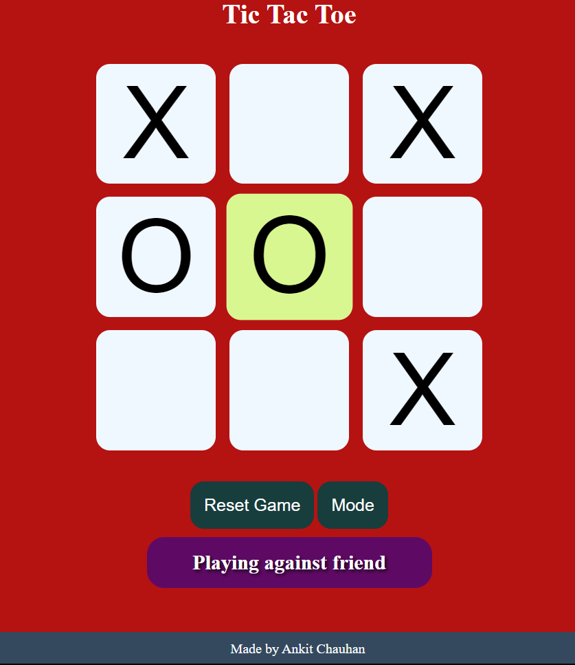

# Tic Tac Toe Game

A simple yet stylish Tic Tac Toe game implemented in HTML, CSS, and JavaScript.

## Table of Contents

- [Demo](#demo)
- [Features](#features)
- [Code Structure](#code-structure)
- [Installation](#installation)
- [Usage](#usage)
- [Contributing](#contributing)
- [License](#license)

## Demo

https://whoankitchauhan.github.io/PRODIGY_WD_03/

<p align="center">
  
</p>


## Features

### 1. Play Modes

Choose between playing against a friend or against the computer. The game supports two-player mode for friendly matches and a single-player mode against a computer opponent.

### 2. Stylish Design

The game features a responsive and visually appealing design. Each move triggers a subtle animation, and hover effects provide a delightful user experience.

### 3. Reset Game

Reset the game at any time with the "Reset Game" button. This allows players to start a new game or correct mistakes during play.

### 4. Computer Opponent

In single-player mode, the computer opponent makes random moves. The game logic ensures a challenging experience for players.

## Code Structure

The code follows a modular structure:

- **HTML (`index.html`):** Defines the structure of the game, including the game board, buttons, and message displays.

- **CSS (`styles.css`):** Provides styles for the game elements, ensuring an attractive and responsive layout.

- **JavaScript (`script.js`):** Implements the game logic, handling player moves, checking for a winner, managing the computer opponent, and updating the UI.

## Installation

1. gitClone the repository:

   ```bash
   git clone https://github.com/your-username/PRODIGY_WD_03.git


## Usage

1. Open the `index.html` file in a web browser.
2. Click on the boxes to make your moves.
3. Use the "Reset Game" button to start a new game.
4. Click "Play Against Computer" to toggle between playing against a friend and playing against the computer.

## Contributing

Contributions are welcome! Follow these steps:

1. Fork the repository.
2. Create a new branch: `git checkout -b feature/your-feature`.
3. Make your changes and commit them: `git commit -m 'Add new feature'`.
4. Push to the branch: `git push origin feature/your-feature`.
5. Submit a pull request.

For any questions or further discussions, feel free to contact me:

- **Email:** [whoankitchauhan@gmail.com](mailto:whoankitchauhan@gmail.com)
- **LinkedIn:** www.linkedin.com/in/whoankitchauhan

## License

This project is licensed under the MIT License.
